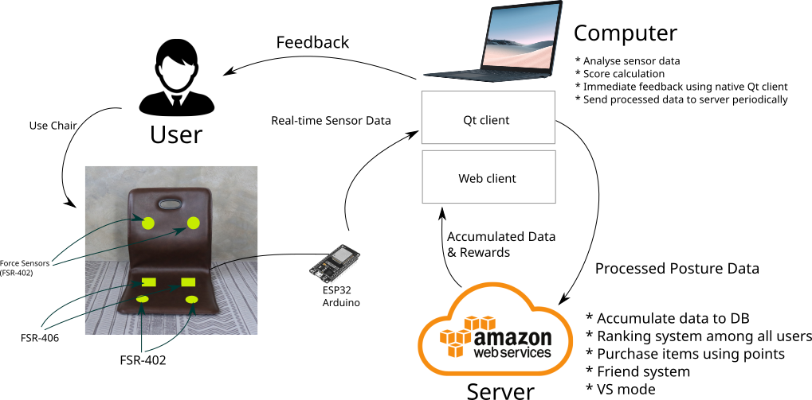
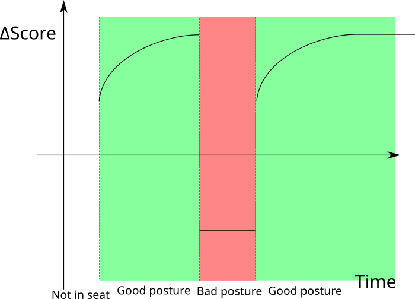
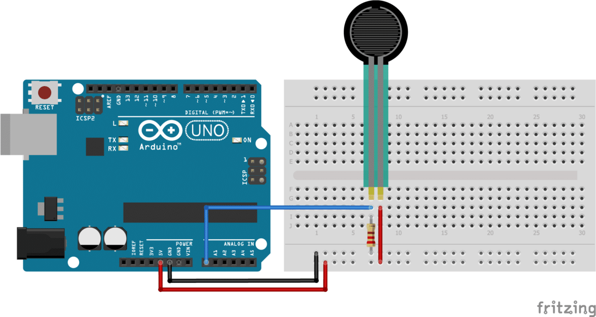
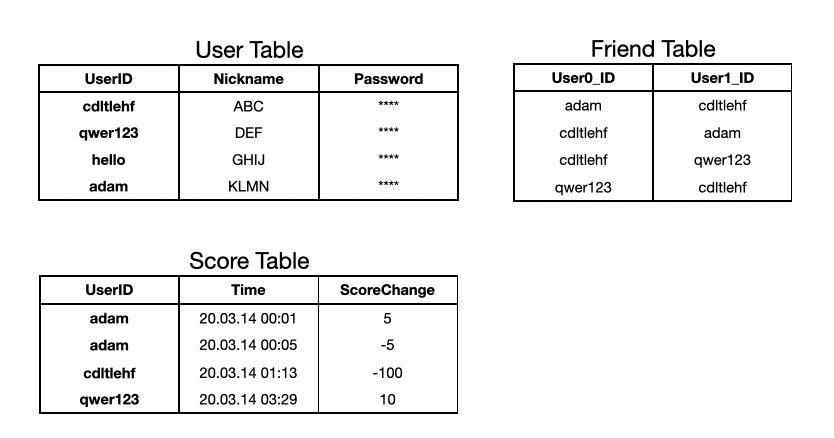

# 성공의 자세 : IoT기술을 활용한 척추건강습관 개선 솔루션

> 팀명: 스파이
>
> 프로젝트명: IoT기술을 활용한 척추건강습관 개선 솔루션
>
> 제품명: 성공의 자세

## 문제인식

컴퓨터 앞에 오래 앉아 있다 보면 자신도 모르게 자세가 흐트러지기 마련입니다. 질못된 자세로 오래 있으면 척주나 목에 무리가 가고 심각한 건강상 문제가 생길 수 있습니다.

## 목표

위와 같은 문제를 방지하기 위해 올바르지 못한 자세를 취하면 모니터를 통해 시각적 피드백을 주는 서비스를 제작해, 사용자에게 바른 자세를 유지하는 습관을 심어 주는 것을 목표로 합니다. 척추 건강이 좋아지는 것은 눈에 보이지 않으니 사람들이 자세를 잘 고치지 못합니다. 그런데 자세를 바르게 하면 실시간으로 점수가 오르는 걸 보면 동기부여가 더 잘 될 것으로 보입니다.

## 구체적인 방안

* 압력 센서(FSR-406) 등을 이용하여 올바르지 못한 자세를 감지
* 수집된 데이터를 분석하여 사용자에게 시각적 피드백 제공
* 장기적으로 얼마나 자세가 개선되었는지 제공

## 시스템 구성도



아두이노에서는 센서로부터 데이터를 취득한 후, 실시간으로 UDP 통신을 통해 데스크톱 프로그램으로 전송한다. Qt를 사용하여 데스크톱 환경에서 돌아가는 프로그램을 작성하며, 데스크톱 프로그램에서는 자세를 식별한 후 올바르지 않다고 판단 될 경우 UI를 통해 사용자에게 알린다. 데스크톱 프로그램에서는 식별한 자세를 바탕으로 점수를 계산하며, 5분 간격으로 API를 통하여 AWS 서버로 보낸다. AWS 서버에서는 이를 MySQL DB에 저장한다.
사용자는 웹브라우저를 통하여 점수 페이지에 접속 할 수 있으며, 주변인들의 점수와 순위를 확인 할 수 있다. 또한 사용자의 날짜별 자세 분포를 시각적으로 제공하여 사용자의 자세 개선 여부를 파악할 수 있도록 한다.

## 점수 계산 방식



## Wiring



## 핵심 코드

```cpp
void setup() {
    pinMode(27, INPUT);
}

void loop() {
  int force = analogRead(27);
    
  // TODO: send force to Qt Client
  
  delay(100);
}
```


## DB Schema



## 기대성과

* 자세 교정 등 척추를 똑바로 하는 자세를 습관화

## Our Team Members

* 구성원:
* 성시철 (팀장) 
  * 프로젝트 통합 관리
  * 프로젝트 스케줄 관리
  * 프로젝트 자원 관리
  * 서버 개발
  * 서버 api 설계 및 구현
* 박건 (커미터) 
  * 서비스 설계
  * 커미터
  * UI/UX 개발
  * 클라이언트 개발
  * 플로우차트
* 이희준 (발표자) 
  * Arduino 개발
  * 하드웨어 디자인 
  * 품질 관리
  * 코드 리뷰
  * 리포트 작성

## 개발환경

* github 중심의 pull request 방식으로 agile 개발
* slack 사용 소통

### Milestones

* 4월: 각종 센서 구입, 알고리즘 연구
* 5월: 아두이노 코드 작성, 서버 코드 작성
* 6월: 논문 작성, 발표
