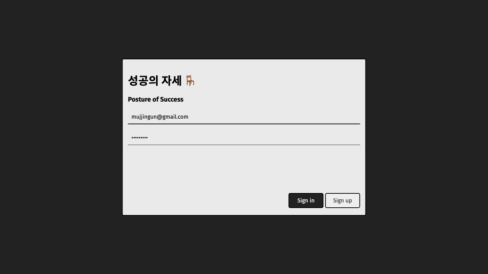

## 프로젝트 개요

### 프로젝트 소개
* 팀명 : 스파이
* 팀원 : 성시철, 박건, 이희준
* 프로젝트명 : IoT기술을 활용한 척추건강습관 개선 솔루션
* 제품명 : 성공의 자세

### 문제인식
컴퓨터 앞에 오래 앉아 있다 보면 자신도 모르게 자세가 흐트러지기 마련입니다. 질못된 자세로 오래 있으면 척추나 목에 무리가 가고 척추측만증과 같은 심각한 건강상 문제가 생길 수 있습니다.

### 목표
위와 같은 문제를 방지하기 위해 올바르지 못한 자세를 취하면 모니터를 통해 시각적 피드백을 주는 서비스를 제작해, 사용자에게 바른 자세를 유지하는 습관을 심어 주는 것을 목표로 합니다. 척추 건강이 좋아지는 것은 눈에 보이지 않으니 사람들이 자세를 잘 고치지 못합니다. 그런데 자세를 바르게 하면 실시간으로 점수가 오르는 걸 보면 동기부여가 더 잘 될 것으로 보입니다.

## 구체적인 방안
* 압력 센서(FSR-406) 등을 이용하여 올바르지 못한 자세를 감지
* 수집된 데이터를 분석하여 사용자에게 시각적 피드백 제공
* 장기적으로 얼마나 자세가 개선되었는지 제공

### 시스템 구성도


아두이노에서는 센서로부터 데이터를 취득한 후, 실시간으로 UDP 통신을 통해 데스크톱 프로그램으로 전송한다. Qt를 사용하여 데스크톱 환경에서 돌아가는 프로그램을 작성하며, 데스크톱 프로그램에서는 자세를 식별한 후 올바르지 않다고 판단 될 경우 UI를 통해 사용자에게 알린다. 데스크톱 프로그램에서는 식별한 자세를 바탕으로 점수를 계산하며, 5분 간격으로 API를 통하여 AWS 서버로 보낸다. AWS 서버에서는 이를 MySQL DB에 저장한다. 사용자는 웹브라우저를 통하여 점수 페이지에 접속 할 수 있으며, 주변인들의 점수와 순위를 확인 할 수 있다. 또한 사용자의 날짜별 자세 분포를 시각적으로 제공하여 사용자의 자세 개선 여부를 파악할 수 있도록 한다.

### 점수 계산 방식


### Wiring


### 핵심 코드

* 아두이노 코드

```cpp
 #include <WiFi.h>
 #include <WiFiUdp.h>
 #include <EEPROM.h>

 #include "esp32-hal-adc.h" // needed for adc pin reset
 #include "soc/sens_reg.h" // needed for adc pin reset
 uint64_t reg_b; // Used to store Pin registers

 const char* udpAddress = "192.168.0.255";
 const int udpPort = 8080;
 const char* broadcastMsg = "Hello, world!";

 WiFiUDP udp;
 WiFiClient client;

 const int left_back_pin = 39;
 const int left_hip_pin = 36;
 const int left_thigh_pin = 34;

 const int right_back_pin = 32;
 const int right_hip_pin = 35;
 const int right_thigh_pin = 33;

 const int trigPin = 14;
 const int echoPin = 12;

 bool testWifi(void)
 {
   int c = 0;
   Serial.println("Waiting for Wifi to connect");
   while ( c < 20 ) {
     if (WiFi.status() == WL_CONNECTED)
     {
       return true;
     }
     delay(500);
     Serial.print("*");
     c++;
   }
   Serial.println("");
   Serial.println("Connect timed out, opening AP");
   return false;
 }

 volatile unsigned long travelTime;  // Place to store traveltime of the pusle
 volatile unsigned long startTime;   // Place to store ping times (interrupt)

 /****************************************************************
       Retrieve measurement and set next trigger
 ****************************************************************/
 int doMeasurement()
 {
   // First read will be 0 (no distance  calculated yet)
   // Read the previous result (pause interrupts while doing so)
   noInterrupts();   // cli()
   unsigned long tt = travelTime;
   interrupts();   // sei();

   digitalWrite(trigPin, HIGH);    // HIGH pulse for at least 10µs
   delayMicroseconds(10);
   digitalWrite(trigPin, LOW);     // Set LOW again

   float distance = tt / 2.0 * 343.0 / 10000.0;   // in cm
   int mm = distance * 10; // in mm
   if (mm > 10000) {
     mm = -1;
   }

   return mm;
 }
 /****************************************************************
       INTERRUPT handling
 ****************************************************************/
 // INTerrupt 0 (pin 2 on Uno)
 void call_INT0()
 {
   byte pinRead = digitalRead(echoPin);

   unsigned long currentTime = micros();  // Get current time (in µs)
   if (pinRead)
   {
     // If pin state has changed to HIGH -> remember start time (in µs)
     startTime = currentTime;
   }
   else
   {
     // If pin state has changed to LOW -> calculate time passed (in µs)
     travelTime = currentTime - startTime;
   }
 }

 void setup() {
   Serial.begin(115200);
   while (!Serial) {
     ; // Wait for Serial
   }

   // setup distance sensor
   pinMode(trigPin, OUTPUT);   // Set common triggerpin as output
   // Manage interrupt pins here
   pinMode(echoPin, INPUT);    // Set interrupt pin as INPUT
   attachInterrupt(digitalPinToInterrupt(echoPin), call_INT0, CHANGE); // ISR for INT0

   // setup force sensor
   pinMode(left_back_pin, INPUT);
   pinMode(left_hip_pin, INPUT);
   pinMode(left_thigh_pin, INPUT);
   pinMode(right_back_pin, INPUT);
   pinMode(right_hip_pin, INPUT);
   pinMode(right_thigh_pin, INPUT);

   // Save Pin Registers : Do this before begin Wifi
   reg_b = READ_PERI_REG(SENS_SAR_READ_CTRL2_REG);

   // setup wifi
   EEPROM.begin(512); //Initialasing EEPROM

   Serial.println("Reading EEPROM ssid");

   String esid;
   for (int i = 0; i < 32; ++i) {
     esid += char(EEPROM.read(i));
   }
   Serial.println();
   Serial.print("SSID: ");
   Serial.println(esid);
   Serial.println("Reading EEPROM pass");

   String epass = "";
   for (int i = 32; i < 96; ++i) {
     epass += char(EEPROM.read(i));
   }
   Serial.print("PASS: ");
   Serial.println(epass);

   bool rewrite = false;

   WiFi.begin(esid.c_str(), epass.c_str());
   if (testWifi()) {
     Serial.println("Succesfully Connected!!!");
   }
   else {
     rewrite = true;

     //Init WiFi as Station, start SmartConfig
     WiFi.mode(WIFI_AP_STA);
     WiFi.beginSmartConfig();

     //Wait for SmartConfig packet from mobile
     Serial.println("Waiting for SmartConfig.");
     while (!WiFi.smartConfigDone()) {
       delay(500);
       Serial.print(".");
     }

     Serial.println("");
     Serial.println("SmartConfig received.");
   }

   //Wait for WiFi to connect to AP
   Serial.println("Waiting for WiFi");
   while (WiFi.status() != WL_CONNECTED) {
     delay(500);
     Serial.print(".");
   }

   Serial.println("");
   Serial.print("Connected to ");
   Serial.println(WiFi.SSID());
   Serial.print("IP address: ");
   Serial.println(WiFi.localIP());

   if (rewrite) {
     String qsid = WiFi.SSID();
     String qpass = WiFi.psk();

     Serial.println("clearing eeprom");
     for (int i = 0; i < 96; ++i) {
       EEPROM.write(i, 0);
     }
     Serial.println(qsid);
     Serial.println("");
     Serial.println(qpass);
     Serial.println("");

     Serial.println("writing eeprom ssid:");
     for (int i = 0; i < qsid.length(); ++i)
     {
       EEPROM.write(i, qsid[i]);
       Serial.print("Wrote: ");
       Serial.println(qsid[i]);
     }
     Serial.println("writing eeprom pass:");
     for (int i = 0; i < qpass.length(); ++i)
     {
       EEPROM.write(32 + i, qpass[i]);
       Serial.print("Wrote: ");
       Serial.println(qpass[i]);
     }
     EEPROM.commit();
   }
   udp.begin(udpPort);
 }

 int readForce(int pin) {
   int val = analogRead(pin);
   return val;
 }

 void loop() {
   // wifi
   Serial.print("Broadcasting: ");
   Serial.println(broadcastMsg);
   udp.beginPacket(udpAddress, udpPort);
   udp.print("Hello, world!");
   udp.endPacket();

   uint8_t buffer[50];
   memset(buffer, 0, 50);
   int packetSize;
   if((packetSize = udp.parsePacket()))
   {
     Serial.printf("packet size= %d\n", packetSize);
     udp.read(buffer, 50);
     Serial.print("Got server IP: ");
     Serial.println((char *)buffer);
     for (int i = 0; !client.connect((char*)buffer, 8081); ++i) {
         if (i >= 100) {
           return;
         }
         Serial.println("Connection to host failed, trying again...");
     }
     Serial.printf("Connection to host succeed: %s:%d\n", (char*)buffer, 8081);
     while(true) {
       int mm = doMeasurement();

       WRITE_PERI_REG(SENS_SAR_READ_CTRL2_REG, reg_b);
       SET_PERI_REG_MASK(SENS_SAR_READ_CTRL2_REG, SENS_SAR2_DATA_INV);

       int left_back_val = readForce(left_back_pin);
       int left_hip_val = readForce(left_hip_pin);
       int left_thigh_val = readForce(left_thigh_pin);

       int right_back_val = readForce(right_back_pin);
       int right_hip_val = readForce(right_hip_pin);
       int right_thigh_val = readForce(right_thigh_pin);

       int nBytes = client.printf("%d, %d, %d, %d, %d, %d, %d\n",
         left_back_val, left_hip_val, left_thigh_val,
         right_back_val, right_hip_val, right_thigh_val,
         mm);
       if (nBytes == 0) {
         return;
       }

       delay(100);
     }
   }

   delay(100);
 }
```

### DB Schema


## 기대성과

* 자세 교정 등 척추를 똑바로 하는 자세를 습관화

## 성과

###  '성공의 자세' 센서의자


### '성공의 자세' 클라이언트 프로그램

* 로그인 창


* 초기 센서 조정 창


* 바른 자세로 앉아 있는 경우 -> 점수만 표시


* 자세가 틀린 경우 -> 점수 그래프와 틀린 자세 표시


### '성공의 자세' 웹사이트

* 로그인 창


* 회원가입 창


* 유저 통계


* 글로벌과 주간 랭킹



* 다른 유저의 그래프와 대조하기


* 모바일 화면


### Our Team Members
* 성시철 (팀장) 
  * 프로젝트 통합 관리
  * 프로젝트 스케줄 관리
  * 프로젝트 자원 관리
  * 서버 개발
  * 서버 api 설계 및 구현
* 박건 (커미터) 
  * 서비스 설계
  * 커미터
  * UI/UX 개발
  * 클라이언트 개발
  * 플로우차트
* 이희준 (발표자) 
  * Arduino 개발
  * 하드웨어 디자인 
  * 품질 관리
  * 코드 리뷰
  * 리포트 작성

----

## Wiki
http://cscp2.sogang.ac.kr/CSE4186/index.php/IoT%EA%B8%B0%EC%88%A0%EC%9D%84_%ED%99%9C%EC%9A%A9%ED%95%9C_%EC%B2%99%EC%B6%94%EA%B1%B4%EA%B0%95%EC%8A%B5%EA%B4%80_%EA%B0%9C%EC%84%A0_%EC%86%94%EB%A3%A8%EC%85%98
